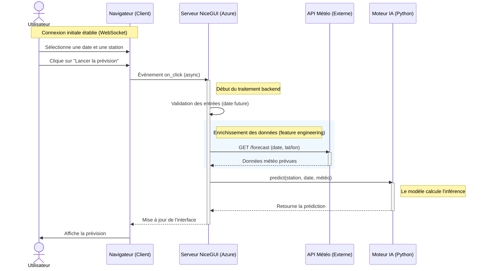

# Brief - Prévision du trafic cyclable de Montpellier

## 1. Fonctionnalités principales

### A. Application

L'objectif est de fournir une interface utilisateur de consultation du trafic cyclable de la métropôle montpellieraine. L'interface exposera les différents compteurs de la ville et exposera :

- Les données historiques de trafic (filtrer par station, jour, semaine);
- Voir une estimation (prédiction) du trafic au jour J;
- Différentes statistiques (augmentation/diminution du trafic par rapport à J-1/2)
- Carte -> position des compteurs


### B. Partie IA

- **Ré-entraînement**: Automatiser l'entraînement du modèle avec les nouvelles données (toutes semaines ? mois ?)
- **Versioning**: Quel modèle employé ?

### C. Monitoring

- **Métrique**: Aperçu des performances des modèles

- **Alerte "Data"**: Si l'API de Montpellier ne répond plus ou envoie des données erronées.

- **Alerte "Modèle"**: Si l'erreur de prévision (RMSE?) dépasse un seuil critique (à déterminer)

## 2. Architecture & Technologies

### Arborescence

```
mon_projet_velo/
│
├── data/                   # Données CSV/JSON (ignoré par Git sauf exemples)
├── models/                 # Vos fichiers .pkl entraînés
│
├── src/
│   ├── main.py             # Point d'entrée (Lancement de NiceGUI)
│   │
│   ├── ui/                 # TOUT ce qui concerne l'interface
│   │   ├── layout.py       # Le header, le menu, le footer
│   │   ├── pages.py        # La page "Dashboard", la page "Prévision"
│   │   └── charts.py       # Les fonctions pour dessiner les graphes
│   │   └── map.py          # Les fonctions pour afficher la map de Montpellier
│   │
│   ├── core/               # La logique métier
│   │   ├── prediction.py   # Fonction qui charge le modèle et prédit
│   │   ├── database.py     # Gestion de la connexion aux données
│   │   └── ingestion.py    # Le script de récolte de données via l'API MMM
│   │
│   └── theme.py            # Couleurs, CSS personnalisé (Charte graphique)
│
├── requirements.txt
└── README.md
```

### A. Frontend

- NiceGui

*Rôle*: Affiche les données et envoie les demandes à l'API

### B. Backend

- FastAPI

*Rôle*: Reçoit le json + id station -> charge le modèle -> renvoie la prédiction

### C. Base de données

A déterminer

## Diagramme de séquence


