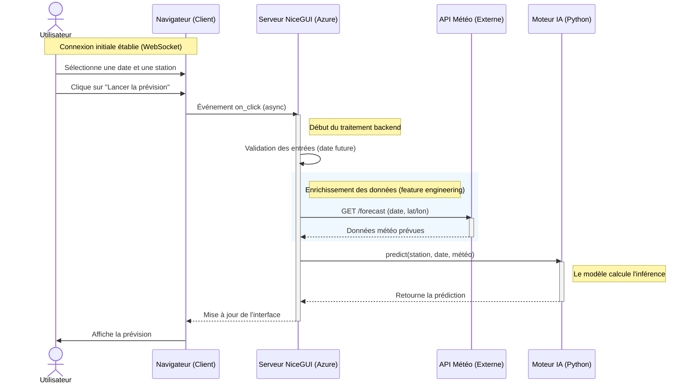

# Brief - Prévision du trafic cyclable de Montpellier

## 1. Fonctionnalités principales

### A. Application

L'objectif est de fournir une interface utilisateur de consultation du trafic cyclable de la métropôle montpellieraine. L'interface exposera les différents compteurs de la ville et exposera :

- Les données historiques de trafic (filtrer par station, jour, semaine);
- Voir une estimation (prédiction) du trafic au jour J;
- Différentes statistiques (augmentation/diminution du trafic par rapport à J-1/2)
- Carte -> position des compteurs


### B. Partie IA

- **Récupération des données**: Gestion quotidienne de récupération des données réelles via l'API MMM et des données météo

- **Prédiction**: A partir du modèle entraîné et des données du jour, faire une prédiction du jour

### C. Monitoring

- **Métrique**: Aperçu des performances des modèles

- **Alerte "Data"**: Si l'API de Montpellier ne répond plus ou envoie des données erronées.

- **Alerte "Modèle"**: Si l'erreur de prévision (RMSE?) dépasse un seuil critique (à déterminer)

## 2. Architecture & Technologies

### Arborescence

```
prediction_velo_montpellier/
│
├── main.py                   # Le point de lancement unique
├── requirements.txt          # Les librairies (pandas, nicegui, scikit-learn...)
│
├── backend/                  
│   ├── __init__.py           # Rend le dossier importable
│   ├── model_service.py      # Charge le .pkl et fait la prédiction
│   ├── weather_service.py    # Connecteur API Météo
│   └── data_repository.py    # Connexion BDD / Chargement CSV
│
├── frontend/                 # NiceGUI
│   ├── __init__.py
│   ├── router.py             # Gère la navigation (Menu, liens entre pages)
│   ├── theme.py              # Vos couleurs, logo, style CSS commun
│   └── pages/
│       ├── home_page.py      # Page d'accueil (Dashboard)
│       └── predict_page.py   # Page de formulaire de prévision
│
└── data/                     # Stockage local (ignoré par git pour les gros fichiers)
    └── models/
        └── traffic_model_v1.pkl
```

### A. Frontend

- NiceGui

*Rôle*: Affiche les données et envoie les demandes à l'API

### B. Backend

- FastAPI

*Rôle*: Reçoit le json + id station -> charge le modèle -> renvoie la prédiction

### C. Base de données

SQLite3 ? Supabase ? Azure ?

- Architecture relationnelle à 3 tables

**Table A : stations**

Rôle: Savoir où sont les compteurs et permettre de les afficher sur une carte (optionnel)
Structure :

```sql
   station_id VARCHAR(50),
   name VARCHAR(50),
   latitude DECIMAL(10,6),
   longitude DECIMAL(10,6),
   PRIMARY KEY(station_id)

```

**Table B : meteo**


## Diagramme de séquence



## Concepts

### 1. 