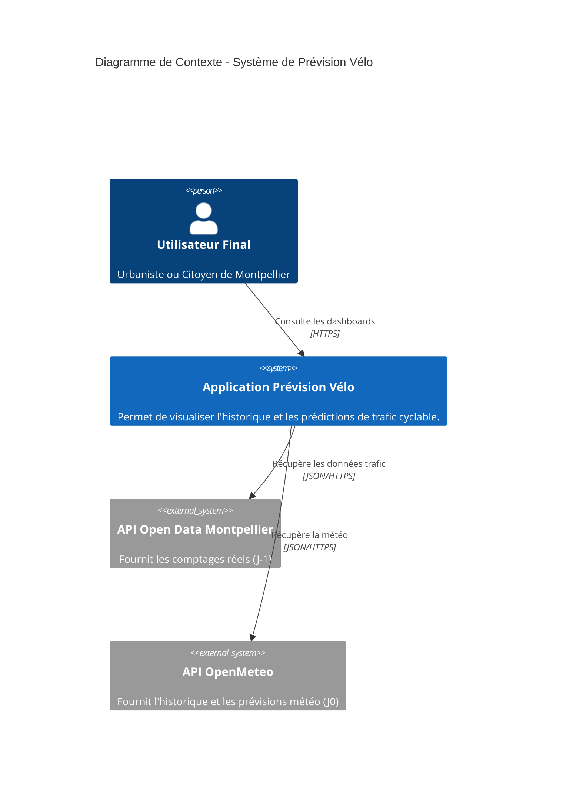
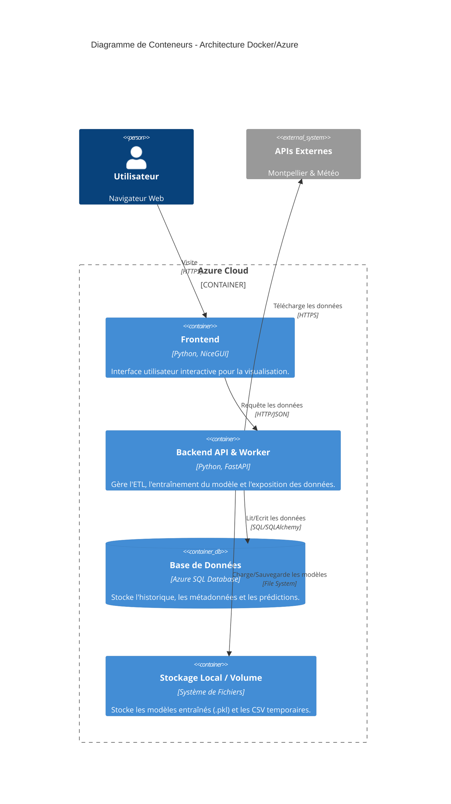
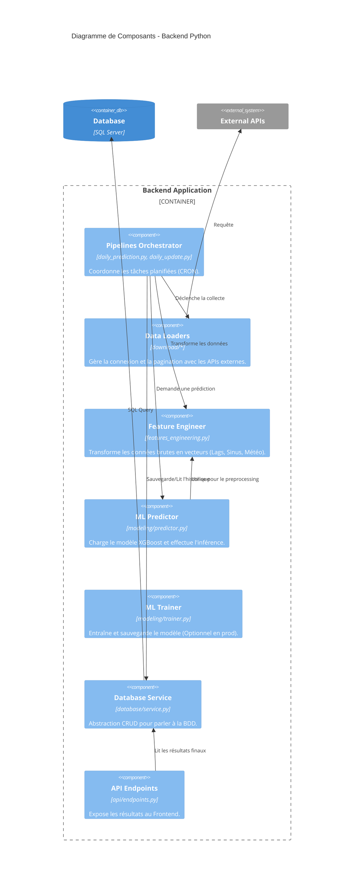

# Projet Prédiction du trafic cyclable de la métropole de Montpellier

- **Langages & Frameworks**


- **ML & Data Science**


- **Base de données & Backend**


- **DevOps & Cloud**


- **Monitoring**


- **Tests & Qualité**


## A propos

Ce projet est une application de Machine Learning conçue pour prédire le trafic cyclable journalier sur les compteurs de la métropole de Montpellier.

Il intègre l'ensemble du cycle de vie de la donnée : de la collecte (ETL) à la restitution (Frontend), en passant par l'entraînement du modèle et le monitoring des performances.

## Architecture projet

Le projet est divisé en deux blocs principaux conteneurisés via Docker :

1. **Backend** : Le moteur de l'application gérant la collecte, le traitement des données ainsi que sa mise à disposition pour l'entraînement du modèle (XGBoost).
2. **Frontend** : L'interface utilisateur pour visualiser les données et les prédictions.

## Arborescence projet

```
backend/
├── api/                            # Couche d'exposition (API REST)
│   ├── api.py                      # Point d'entree de l'application FastAPI
│   ├── endpoints.py                # Définition des routes (GET /predict, etc.)
│   └── server.py                   # Configuration du serveur Uvicorn/Gunicorn
├── core/                           # Configuration coeur
│   ├── dependencies.py             # Gestion des instances (Singleton BDD)
│   └── training.py                 # Constantes liées a l'entraînement
├── data/                           # Stockage local (Volume Docker)
│   ├── raw/                        # Fichiers CSV bruts temporaires
│   ├── models/                     # Artefacts ML (fichiers .pkl)
│   └── output/                     # Exports de données traitées
├── database/                       # Couche de stockage
│   ├── database.py                 # Modèles SQLAlchemy (Tables SQL)
│   ├── fetch_prediction.py         # Requêtes spécifiques de lecture
│   └── service.py                  # CRUD complet (Create, Read, Update, Delete)
├── download/                       # Connecteurs aux APIs externes (Extract)
│   ├── abstract_loader.py          # Classe mère abstraite pour les loaders
│   ├── daily_weather_api.py        # Client API OpenMeteo (Previsions J0)
│   ├── ecocounters_ids.py          # Récuperation de la liste des compteurs
│   ├── geocoding_service.py        # Service de conversion Adresse <-> GPS
│   ├── trafic_history_api.py       # Client API EcoCompteur (Historique avec pagination)
│   └── weeather_api.py             # Client API OpenMeteo (Archive historique)
├── features/                       # Ingénierie des fonctionnalités (Transform)
│   ├── features_engineering.py     # Transformation Données brute -> Variables ML
│   └── features_vizualization.py   # Outils graphiques pour analyser les features
├── modeling/                       # Coeur du Machine Learning
│   ├── predictor.py                # Moteur d'inférence (Charge le modele et predit)
│   ├── preprocessor.py             # Transformation (Scaling, Encodage)
│   └── trainer.py                  # Entraînement (GridSearch, CrossVal, Save)
├── monitoring/                     # Suivi de la qualité
│   └── performance.py              # Calcul des métriques (MAE, RMSE) reel vs predit
├── pipelines/                      # Scripts d'orchestration (Workflows)
│   ├── daily_predictor.py          # Pipeline journalier : Prediction J0
│   ├── daily_update.py             # Pipeline journalier : Mise a jour J-1 + Monitoring
│   ├── data_insertion.py           # Logique d'insertion securisée en BDD
│   ├── initialize_project.py       # Script d'installation initiale (Historique complet)
│   ├── model_training.py           # Pipeline de ré-entraînement complet
│   └── pipeline_visualization.py   # Generation de graphes pour le pipeline
├── src/                            # Utilitaires de traitement de donnees
│   ├── api_data_processing.py      # Nettoyage spécifique aux retours API
│   ├── data_cleaner.py             # Fonctions de nettoyage (dedoublonnage, types)
│   ├── data_exploration.py         # Classe pour générer des stats descriptives
│   └── data_merger.py              # Logique de fusion (Merge Trafic + Meteo)
├── tests/                          # Tests unitaires et d'integration
│   ├── conftest.py                 # Configuration Pytest (Fixtures)
│   ├── test_api.py                 # Tests des endpoints API
│   ├── test_data_insertion.py      # Tests des ecritures en BDD
│   ├── test_database_service.py    # Tests des requêtes SQL
│   └── test_train.py               # Tests du pipeline d'entraînement
├── utils/                          # Outils transverses
│   ├── logging_config.py           # Configuration centralisée des logs
│   ├── paths.py                    # Gestion des chemins absolus
│   └── weather_utils.py            # Parsing des réponses OpenMeteo
├── .dockerignore                   # Fichiers exclus du build Docker
├── Dockerfile                      # Définition de l'image Backend
├── main.py                         # Point d'entrée CLI (Menu principal)
├── main_initialize.py              # Raccourci pour l'initialisation
└── requirements.txt                # Dépendances Python
frontend/
├── app.py                          # Point d'entrée de l'application Web
├── components.py                   # Widgets graphiques réutilisables
├── data.py                         # Connecteur pour récuperer les données du Backend
├── plots.py                        # Fonctions de génération de graphiques
├── requirements.txt                # Dépendances Frontend
├── .dockerignore
└── Dockerfile                      # Definition de l'image Frontend
.gitignore                          # Fichiers exclus de Git
README.md                           # Documentation du projet
docker-compose.yml                  # Orchestration des conteneurs
prometheus.yml                      # Configuration monitoring infrastructure
reset_db.py                         # Script utilitaire pour vider la base
```

## Structure détaillée (backend)

L'architecture backend suit le principe de séparation des processus.

1. **La Couche Données** (download/, database/, src/)

Gère l'extraction (APIs), le nettoyage bas niveau et le stockage persistant. C'est la fondation ETL du projet.

2. **La Couche Intelligence** (features/, modeling/)

Contient la logique pure de Data Science. C'est ici que les données sont transformées en vecteurs mathématiques et que le modèle XGBoost est entraîné et utilisé.

3. **L'Orchestration** (pipelines/)

Coordonne les briques précédentes. Ce sont les scripts exécutables qui définissent "quoi faire et dans quel ordre" (ex: d'abord télécharger la météo, puis interroger la BDD, puis prédire).

4. **Le Controle Qualité** (monitoring/, tests/)

Assure la fiabilité du système via des tests automatiques et un calcul quotidien de la performance du modèle face à la réalité.

## Stack technique

- Langage : Python

- Data Engineering : Pandas, SQLAlchemy.

- Machine Learning : Scikit-Learn, XGBoost.

- API : FastAPI.

- Frontend : NiceGUI.

- Base de Données : Azure SQL Database.

- DevOps : Docker, GitHub Actions.

- Monitoring : Prometheus & Grafana.

## Monitoring & Maintenance

Les performances du modèle sont stockées quotidiennement dans la table model_metrics.

**Ré-entraînement** : Le pipeline model_training.py peut être lancé (via main.py) pour mettre à jour le modèle avec les dernières données, incluant les nouveaux compteurs installés.

## Guide d'installation

### Accès production (Azure)

- **Interface** : https://pred-vel-mtp-front-gfd6gkgsdrdshvhc.francecentral-01.azurewebsites.net/
- **Documentation API** : https://velo-pred-mtp-back-bzbmghezh7ergzhs.francecentral-01.azurewebsites.net/docs

### Accès local

1. **Prérequis**
    - Git
    - Docker Desktop

2. **Configuration des variables d'environnement**
   - Créer un .env
   - Rajouter les informations suivantes

```
# Connexion à la base de données
DATABASE_URL="<lien_vers_votre_bdd>"

# Configuration API locale
API_BASE_URL="http://backend:8000"
WEBSITES_PORT=8000
```

3. **Lancement des conteneurs**

   - Utilisation de ```docker compose``` pour le lancement des 4 services (backend, frontend, Prometheus, Grafana)

```
docker compose up --build -d
```

4. **Initialisation du projet (premier lancement)**

```
docker compose exec backend main_initialize.py

```

*Le script lance* :

- La création de votre base de données.
- Le téléchargement de l'historique du trafic cyclable depuis 2023.
- La récupération des données météo depuis 2023.
- Le traitement des données (nettoyage, preprocessing)
- L'entraînement premier du modèle (XGBoost)

5. **Accéder aux services**

| Service | URL | Description | Identifiants (si requis) |
| :--- | :--- | :--- | :--- |
| **Frontend** | [http://localhost:8080](http://localhost:8080) | Interface utilisateur NiceGUI | - |
| **API Docs** | [http://localhost:8000/docs](http://localhost:8000/docs) | Swagger UI du Backend | - |
| **Prometheus** | [http://localhost:9090](http://localhost:9090) | Collecte des métriques | - |
| **Grafana** | [http://localhost:3000](http://localhost:3000) | Dashboard de monitoring technique | `admin` / `admin` |

6. **Arrêt de l'application**

```
docker compose down
```

*Pour plus de détails, veuillez consulter notre [documentation](https://loicgoi.github.io/Prediction_velo_Montpellier/).*

## Modèle C4

### 1. Diagramme de Contexte



### 2. Diagramme de Conteneur



### Diagramme de Composants


