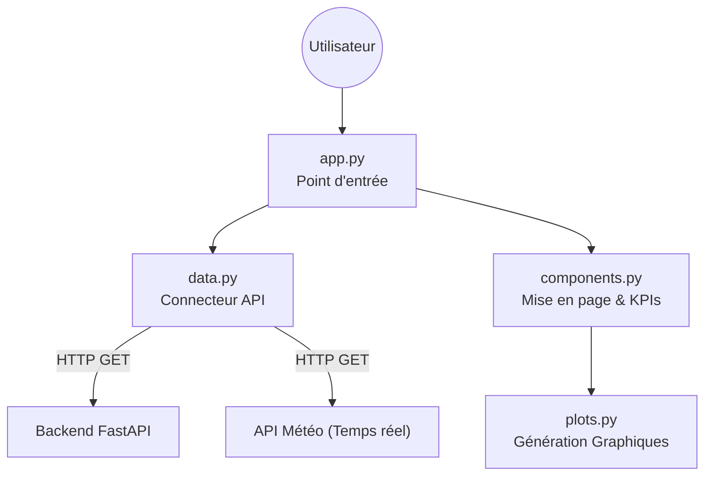

# Interface Utilisateur & API

Cette section décrit la couche d'exposition du projet. L'architecture suit un modèle **Client-Serveur** strict :
* Le **Backend** expose les données et les calculs via une API REST (FastAPI).
* Le **Frontend** (NiceGUI) consomme ces données pour afficher le tableau de bord.

---

## 1. Backend API (FastAPI)

L'API sert de passerelle entre la base de données/les modèles et le monde extérieur. Elle est configurée dans le dossier `backend/api/`.

### Cycle de Vie & Configuration (`api.py`)
L'application utilise le gestionnaire de contexte `lifespan` pour gérer proprement les ressources :
* **Démarrage :** Lancement du planificateur de tâches (`scheduler`).
* **Arrêt :** Fermeture propre des threads.
* **CORS :** Configuré pour autoriser le Frontend (port 8080) à interroger l'API.
* **Monitoring :** Exposition des métriques techniques via `/metrics` (Prometheus).

### Endpoints Disponibles (`endpoints.py`)

Les routes sont préfixées par `/api`.

| Méthode | Route | Description | Usage Frontend |
| :--- | :--- | :--- | :--- |
| `GET` | `/counters` | Récupère la liste de tous les compteurs actifs. | Remplit le menu déroulant de sélection. |
| `GET` | `/dashboard/{station_id}` | **Endpoint Aggrégé.** Renvoie en un seul appel : la prédiction du jour, la précision d'hier, et les statistiques historiques (30j, hebdomadaire). | Alimente tous les graphiques et KPIs. |
| `GET` | `/predict` | Renvoie la dernière prédiction brute pour un compteur. | Debug / Usage unitaire. |
| `POST` | `/train` | Déclenche le ré-entraînement du modèle en tâche de fond (`BackgroundTasks`). | Administration. |
| `POST` | `/update` | Déclenche la mise à jour des données journalières (J-1). | Administration. |

---

## 2. Frontend (NiceGUI)

L'interface utilisateur est une application web Python autonome située dans le dossier `frontend/`. Elle est conçue pour être modulaire.

### Architecture des Composants



### Détail des modules

- **app.py** :

    - Gère la structure de la page (Header, Menu).
    - Maintient l'état de la session utilisateur (ID de la station sélectionnée).
    - Appelle ```render_counter_content``` lors du changement de sélection.

- **data.py** : 

    - Agit comme un "proxy". Le Front ne parle jamais directement à la base de données.
    - ```get_dashboard_data(id)``` : appelle l'endpoint ```/api/dashboard/{id}``` du backend.
    - ```get_real_weather(lat,lon)``` : appelle directement l'API OpenMeteo pour afficher la météo actuelle.
    - Utilisation d'un système de cache simple (```_COUNTERS_CACHE```) pour ne pas recharger la liste des stations à chaque clic.

- **components.py** :

    - Responsable de l'affichage de métriques (comparaison valeurs prédites vs réelles)
    - Intègre la carte interactive
    - Organise les onglets "Tableau de Bord" vs "Analyses".

- **plots.py** : 

    - Génère les graphiques statistiques.

## 3. Flux de données : affichage d'un compteur

1. Frontend (app.py) détecte le changement (on_change).

2. Frontend (data.py) envoie une requête GET /api/dashboard/XTH... au Backend.

3. Backend (endpoints.py) :

- Interroge le DatabaseService.

- Récupère la prédiction J0.

- Calcule les statistiques historiques.

- Renvoie un JSON complet.

4. Frontend (components.py) :

- Reçoit le JSON.

- Calcule le Delta (Erreur) pour le "Bilan Hier".

- Met à jour la carte Leaflet.

- Passe les données historiques à plots.py pour redessiner les courbes Matplotlib.

5. NiceGUI pousse la mise à jour vers le navigateur 