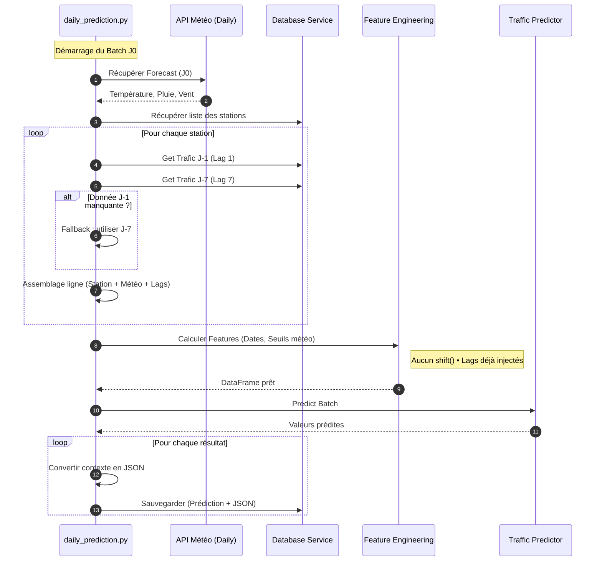

# Documentation Technique : Pipeline de Prediction J0

## 1. Fonctionnement Général & Séquence

Ce pipeline a pour but de predire le trafic cyclable de la journée en cours (J0) pour l'ensemble des stations.
C'est un processus de type Batch (traitement par lot) conçu pour être exécuté chaque matin.

**La logique "Miroir"**

Contrairement a l'entrainement ou l'on dispose d'un historique continu, la prediction a J0 nécessite de reconstruire artificiellement une ligne de données pour chaque station en assemblant des informations éparses :

**Le Futur (Meteo) :** On récupère les prévisions pour aujourd'hui.

**Le Passé (Lags) :** On interroge la base de données pour retrouver les valeurs d'hier (J-1) et de la semaine dernière (J-7).

### Diagramme de Séquence

Ce schema illustre les interactions entre l'orchestrateur et les differents modules.

## 2. Description des Fichiers Impliques

**Nouveaux Fichiers (Crees pour cette feature)**

| Fichier                 | Emplacement        | Rôle                                                                     |
| ----------------------- | ------------------ | ------------------------------------------------------------------------ |
| **daily_prediction.py** | backend/pipelines/ | Orchestrateur. Coordonne API, BDD, feature engineering et modèle.        |
| **predictor.py**        | backend/modeling/  | Moteur d’inférence chargé du modèle `.pkl` et du batch processing.       |
| **weather_utils.py**    | backend/pipelines/ | Extraction et nettoyage des valeurs météo quotidiennes du SDK OpenMeteo. |

**Fichiers modifiés**

| Fichier                     | Emplacement       | Utilité                                       |
| --------------------------- | ----------------- | --------------------------------------------- |
| **daily_weather_api.py**    | backend/download/ | Récupération de la météo du jour.             |
| **features_engineering.py** | backend/features/ | Transformation dates et météo.                |
| **service.py**              | backend/database/ | Lecture des lags et écriture des prédictions. |

## 3. Modifications apportees aux Fichiers Preexistants

Pour permettre le bon fonctionnement du pipeline, le fichier backend/database/service.py a du évoluer :

**Ajout de méthodes de Lecture (GET) :**

get_all_stations() : Pour savoir sur qui prédire.

get_bike_count(station_id, date) : Pour aller chercher précisemment la valeur du passé nécessaire aux Lags.

**Ajout d'une méthode d'Ecriture Transactionnelle (POST) :**

save_prediction_single_with_context(...) : Cette méthode sauvegarde la prediction ET son contexte JSON en une seule transaction atomique. Elle utilise un .flush() pour garantir que le lien (Cle Etrangere) entre la prediction et ses features est correct.

Le fichier backend/main.py a egalement ete modifie pour ajouter l'option 10 au menu principal.

## 4. Guide de Demarrage

**Prerequis Techniques**

*Avant de lancer la prediction J0, le systeme doit etre dans l'etat suivant :*

- Base de données initialisée : Les tables doivent exister.

- Données présentes : La table bike_count doit contenir des données pour J-1 et J-7. Si la base est vide, le pipeline s'arretera (sécurité).

- Modèles entraînés : Les fichiers xgboost_v1.pkl et preprocessor_v1.pkl doivent etre presents dans backend/data/models/.