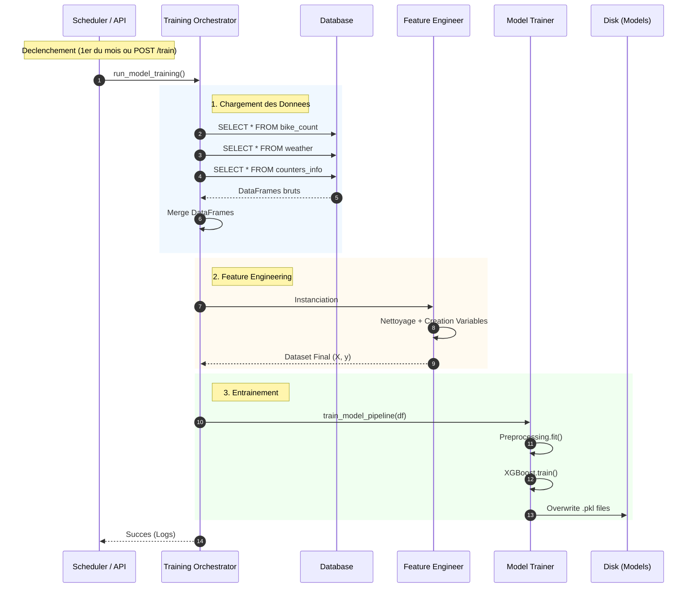

# Pipeline de Réentrainement Mensuel

## Objectif

Le trafic cyclable évolue : de nouvelles pistes ouvrent, les habitudes changent, et de nouveaux compteurs sont installés. Un modèle entrainé en 2023 sera moins performant en 2025.

Ce pipeline a pour but de **régénérer automatiquement** les fichiers du modèle (`xgboost_v1.pkl` et `preprocessor_v1.pkl`) en utilisant **l'integralité de l'historique disponible** en base de données au moment de l'exécution.

## Déclencheurs (Triggers)

Le processus peut être lancé de deux manières :

1. **Automatique (Planifié) :**
   * **Fréquence :** Le 1er de chaque mois a 02h00 du matin.
   * **Composant :** `backend/core/scheduler.py` (APScheduler).

2. **Manuel (Administration) :**
   * **Action :** Requête POST sur l'endpoint `/api/train`.
   * **Mecanisme :** Utilisation de `BackgroundTasks` FastAPI pour ne pas bloquer la reponse HTTP.

## Flux de Données (Workflow)

Le processus est orchestré par le module `training_orchestrator.py`. Voici les étapes séquentielles :

1. **Extraction (SQL -> Pandas) :**
   * Récuperation de tout l'historique `bike_count` (Target).
   * Récuperation de tout l'historique `weather` (Features contextuelles).
   * Récuperation du reférentiel `counters_info` (Lat/Lon).
   * **Fusion :** Merge des trois sources en un seul DataFrame cohérent.

2. **Transformation (Feature Engineering) :**
   * Nettoyage des donnees (calcul de `avg_temp` si manquant).
   * Suppression des compteurs suspects ("Blacklist").
   * Création des variables temporelles, cycliques et météorologiques.
   * Création des Lags (J-1, J-7).

3. **Entrainement & Sauvegarde :**
   * Le Dataset prépare est envoyé au pipeline d'entrainement (`model_training.py`).
   * Le modèle est entraine sur 100% des données (pas de split de test en mode production).
   * Les artefacts `.pkl` sont écrasés dans le dossier `backend/data/models/`.

### Diagramme de Séquence

## Fichiers Impliqués

| Fichier | Rôle Technique |
| :--- | :--- |
| **`core/scheduler.py`** | Configure la tache CRON (`APScheduler`) qui tourne en arrière-plan de l'API. Définit l'heure et la fréquence. |
| **`api/endpoints.py`** | Expose la route POST `/train` et incremente les metriques Prometheus (`training_started_total`). |
| **`core/training_orchestrator.py`** | **Le chef de chantier.** Il fait le lien entre la base de données brute et le pipeline d'entrainement technique. Il gere la logique de fusion des tables SQL. |
| **`pipelines/model_training.py`** | Le script technique qui contient la logique Scikit-Learn/XGBoost (Fit, GridSearch, Save). |

## Points de Vigilance

1. **Temps d'exécution :** Ce processus peut etre long (plusieurs minutes). C'est pourquoi il est exécute de manière asynchrone (Background Task) pour ne pas bloquer l'API.
2. **Disponibilité des données :** Si la base de données est vide ou si la meteo est manquante, l'orchestrateur avorte le processus (`Aborting training`) pour ne pas écraser un bon modèle par un modèle vide.
3. **Redemarrage du Serveur :** Le scheduler est configuré avec `replace_existing=True`. Si le serveur redémarre, la tache planifiée est correctement réenregistrée.