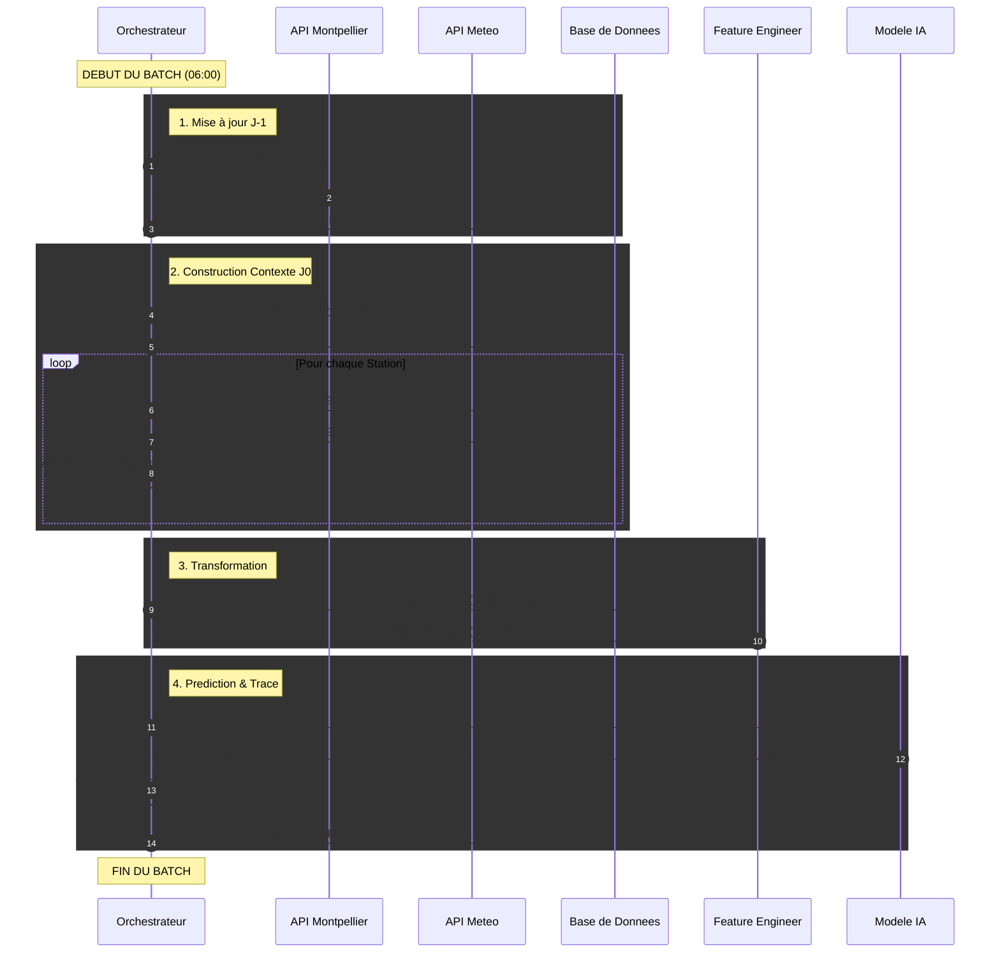

# Documentation : Pipeline de Prédiction Quotidienne (J0)

## Objectif

Ce document décrit la logique derrière la prédiction quotidienne
Il s'agit du processus automatique qui aura lieu tous les jours à une heure déterminée (7h ?).

**Recueillir les données de la veille (J-1).**

**Prédire le trafic cyclable de la journée en cours (J0).**

**Historiser le contexte de décision (Météo + Passé) pour le monitoring.**

## Le Flux Séquentiel

Le processus est orchestré en 4 étapes critiques qui doivent s'exécuter dans l'ordre strict.

### Étape 1 : Mise à jour du Passé (J-1)

Action : Le script interroge l'API Montpellier pour récupérer les comptages réels de la veille.

Pourquoi ? C'est indispensable pour calculer le Lag-1 (trafic d'hier) qui est l'une des variables les plus importantes pour prédire aujourd'hui.

Stockage : Les données sont nettoyées et insérées dans la table TRAFIC (Base de données).

### Étape 2 : Récupération du Contexte (J0)

Nous devons construire une ligne de données "hybride" pour chaque station, composée d'éléments hétérogènes :

Qui ? Liste des stations actives (Source : BDD STATIONS).

Quel temps ? Prévisions météo pour aujourd'hui (Source : API OpenMeteo Forecast). La même météo est appliquée à toutes les stations.

Quel passé ? C'est le point clé.

Le script interroge la BDD pour trouver le trafic exact de la station à J-1 (val_lag_1).

Le script interroge la BDD pour trouver le trafic exact de la station à J-7 (val_lag_7).

Note : Si une station n'a pas d'historique (pas de Lag-1 ou Lag-7), elle est exclue de la prédiction pour garantir la qualité.

## Étape 3 : Feature Engineering "Stateless"

À ce stade, nous avons un DataFrame brut. Nous appliquons les transformations mathématiques pour le rendre compréhensible par le modèle.

Temporel : Extraction du jour de la semaine, mois, année.

Cyclique : Calcul des Sinus/Cosinus pour le mois et le jour.

Météo : Création des seuils binaires (is_rainy, is_cold).

 Important : Nous n'utilisons PAS la méthode de décalage automatique (shift()) ici, car les colonnes lag_1 et lag_7 ont déjà été remplies manuellement à l'étape précédente.

## Étape 4 : Inférence & Sauvegarde

Prédiction : Le modèle (XGBoost) reçoit la matrice de données et prédit l'intensité pour les 65 stations d'un coup (Batch).

Traçabilité  :  Le résultat est stocké dans la table PREDICTIONS.

Le contexte complet (Météo + Lags utilisés) est converti en JSON et stocké dans la colonne dédiée. Cela permet de comprendre a posteriori pourquoi le modèle a pris telle décision.

## Schéma d'Architecture (Séquence)

## Points d'attention pour les développeurs

Pas de shift() : Ne jamais réutiliser la logique d'entraînement qui fait des shift() temporels. En production, le passé est une requête SQL, pas une ligne précédente dans un DataFrame.

Gestion des Trous : Si l'API Montpellier a échoué hier, le Lag-1 sera manquant aujourd'hui. Le script est conçu pour ignorer (skip) ces stations temporairement plutôt que de prédire n'importe quoi.

Format JSON : La colonne features_data est votre meilleure amie pour le débogage. Si une prédiction semble fausse, vérifiez toujours ce JSON avant d'accuser le modèle.